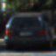
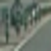
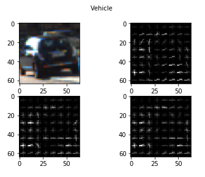
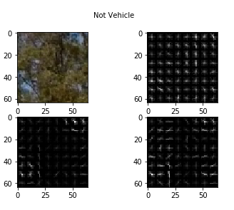
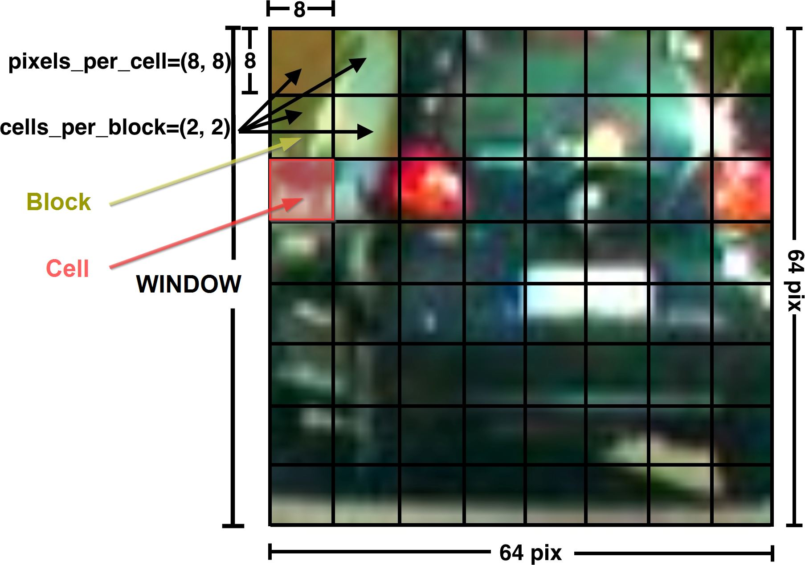
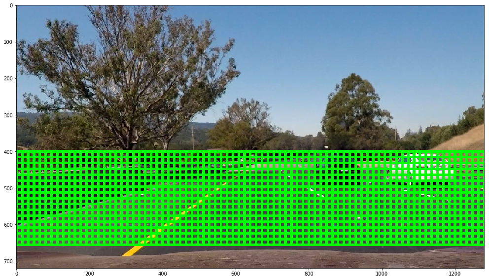
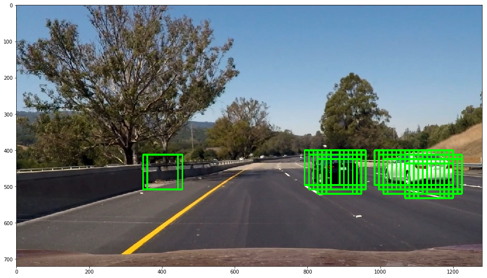
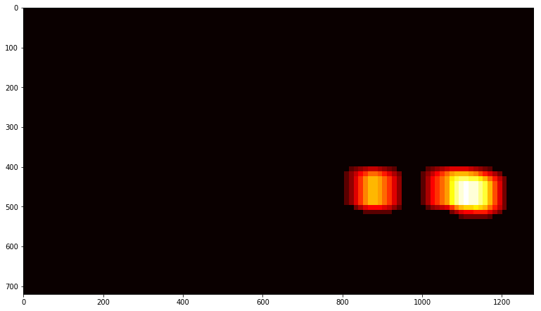
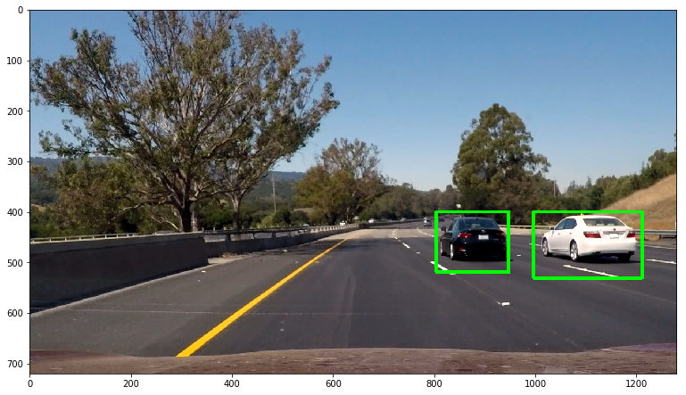

# **Vehicle Detection Project**

The goals / steps of this project are the following:

* Perform a Histogram of Oriented Gradients (HOG) feature extraction on a labeled training set of images and train a classifier Linear SVM classifier
* Apply a color transform and append binned color features, as well as histograms of color, to your HOG feature vector.
* Implement a sliding-window technique and use your trained classifier to search for vehicles in images.
* Run the pipeline on a video stream and create a heat map of recurring detections frame by frame to reject outliers and follow detected vehicles.
* Estimate a bounding box for vehicles detected.

## [Rubric](https://review.udacity.com/#!/rubrics/513/view) Points
### Here I will consider [the rubric points]((https://review.udacity.com/#!/rubrics/513/view)) individually and describe how I addressed each point in my implementation.

---
## Writeup / README

#### 1. Provide a Writeup / README that includes all the rubric points and how you addressed each one.  You can submit your writeup as markdown or pdf.  [Here](https://github.com/udacity/CarND-Vehicle-Detection/blob/master/writeup_template.md) is a template writeup for this project you can use as a guide and a starting point.

You're reading it!

-----

## Histogram of Oriented Gradients (HOG)

#### 1. Explain how (and identify where in your code) you extracted HOG features from the training images.

The code for this step starts from the 4th to the 7th cell of the IPython notebook.

I started by reading in all the `vehicle` and `non-vehicle` images.  Here is an example of one of each of the `vehicle` and `non-vehicle` classes:

 

I then explored different color spaces and different `skimage.hog()` parameters (`orientations`, `pixels_per_cell`, and `cells_per_block`).  I grabbed random images from each of the two classes and displayed them to get a feel for what the `skimage.hog()` output looks like.

Here is an example using the `YCrCb` color space and HOG parameters of `orientations=12`, `pixels_per_cell=(8, 8)` and `cells_per_block=(2, 2)`:

 

#### 2. Explain how you settled on your final choice of HOG parameters.

I tried various combinations of parameters and find that using a combination of
HOG on all channels of `YCrCb` color, histrogram bins and raw color value give me the least false positive. Here are my final parameters:

| Name               |   Value |
| ------------------ | ------- |
| Color Space        |   YCrCb |
| HOG Orient         |      12 |
| HOG Pixel per Cell |       8 |
| HOG Cell per Block |       2 |
| HOG Channel        |     All |
| Spatial size       | 64 x 64 |
| Histrogram Bin     |     100 |

#### 3. Describe how (and identify where in your code) you trained a classifier using your selected HOG features (and color features if you used them).

I trained a linear SVM using the feature from three channels of HOG, histogram and raw pixel value. The code is located at the 7th and 8th cells.

-----

## Sliding Window Search

#### 1. Describe how (and identify where in your code) you implemented a sliding window search.  How did you decide what scales to search and how much to overlap windows?

I first define my region of interest to narrow down the search space. Here I only search on the bottom half of the screen because the top part are always sky and trees. I then swipe from top to bottom and left to right using a step size of 1 cells (8 pixel). I used a small step because I wanted to give the classifier chances to perform predictions. Combined that with thresholding, I have a poorman ensemble classifier at the end. The key take away is, the number of false positive should be lessen after thresholding. And the lower the step size, the more time it takes to train.

#### 2. Show some examples of test images to demonstrate how your pipeline is working.  What did you do to optimize the performance of your classifier?

I uses HOG sub-sampling. So instead of computing HOG on each sliding window. I performed HOG to the entire of region of interest. I then slicing only related part to the window and feed it to the classifier. I, however, have not resized the searching window in this implementation. The idea is reducing the window size as Y moving toward the middle as well as narrowing X to search mostly the center portion of the image.

*Search Area*

-----

## Video Implementation

#### 1. Provide a link to your final video output.  Your pipeline should perform reasonably well on the entire project video (somewhat wobbly or unstable bounding boxes are ok as long as you are identifying the vehicles most of the time with minimal false positives.)

Here's a [link to my video result](result/all.mp4)

#### 2. Describe how (and identify where in your code) you implemented some kind of filter for false positives and some method for combining overlapping bounding boxes.

I recorded the positions of positive detections in each frame of the video. From the positive detections I created a heatmap and then thresholded that map to identify vehicle positions.  I then used `scipy.ndimage.measurements.label()` to identify individual blobs in the heatmap.  I then assumed each blob corresponded to a vehicle.  I constructed bounding boxes to cover the area of each blob detected.

Here's an example result from each steps. Starting from original image to the final bounding box.

1. Original

2. Sliding Window to get windows that might contain a vehicle

3. Applying threshold of 2 and display as a heatmap

4. Plot bounding box on the hot area

---

### Discussion

#### 1. Briefly discuss any problems / issues you faced in your implementation of this project.  Where will your pipeline likely fail?  What could you do to make it more robust?

The main issue for this project was the confusion when reading image using `cv2` and `matplotlib` and differences when reading `jpg` and `png`. Algorithm wise, this current implementation is far from optimized one. It is slow. A lot more can be done. The sliding windows could have improved by adjusting size dynamically and optimizing searching space. The classifier have a few false positive predictions. This can be tuned by collecting more data, add/remove/edit features that being used. Lastly, position of the cars that has been detected should be recorded. The information can be used to eliminate running the whole sliding window.